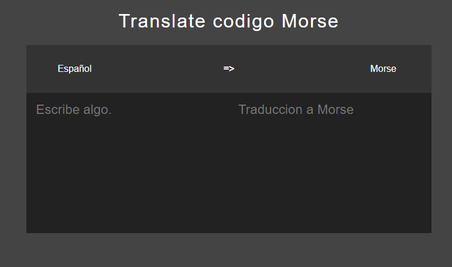

# Morse App

Esta aplicación de escritorio traduce español a codigo Morse,


## Está construida con.

* Electron Js
* Css
* Html
* Node Js


### Ejecutar el proyecto
clona este repositorio para poder probar la aplicacion 

#### Instalacion
```
npm install
```

para ejecutar el programa usa
```
 npm start
```

